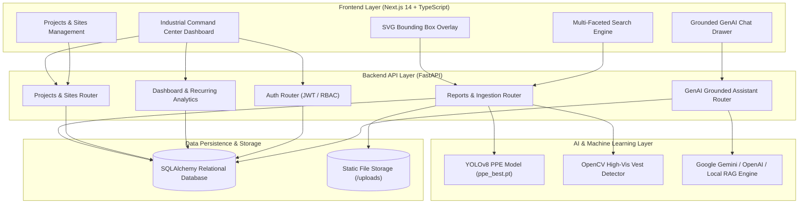
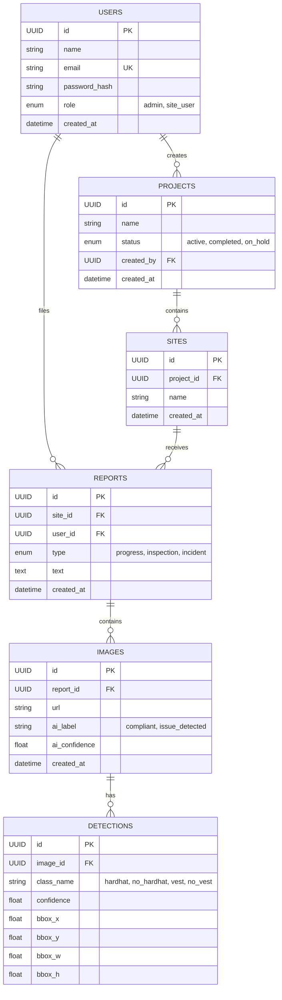

# 🦺 Construction Site Intelligence Platform (SiteSense)
## Comprehensive Architecture, Problem Statement Alignment & Technical Deliverables

---

## 📌 1. Executive Summary & Problem Context

Construction companies generate vast amounts of unstructured, fragmented data daily across site photographs, inspection logs, worker observations, material reports, and daily progress logs. Project managers, safety officers, and supervisors struggle to:
- Quickly identify recurring safety infractions.
- Track real-time progress across hierarchical site zones.
- Compare conditions across different work areas.
- Retrieve historical data and understand site trends through natural language queries.

**SiteSense** is an end-to-end, full-stack **Construction Site Intelligence Platform** that unites:
1. **Modern Industrial Web Application** (Next.js 14 + Tailwind CSS + TypeScript)
2. **High-Performance Async Backend Services** (FastAPI + Python 3.13)
3. **Relational Data Management** (SQLAlchemy Async + SQLite / PostgreSQL)
4. **Computer Vision & Machine Learning** (Fine-tuned YOLOv8n PPE Object Detection + OpenCV)
5. **Grounded Generative AI Assistant** (Multi-engine RAG with Gemini, OpenAI, and Local Synthesis)

---

## 🎯 2. Problem Statement Alignment Matrix

| Problem Statement Question | System Solution | Technical Implementation |
|---|---|---|
| **What is happening at the construction site?** | Continuous field intelligence stream through daily progress logs, safety audits, inspection records, and real-time activity feeds. | • `ReportTypeEnum` (`progress`, `inspection`, `incident`)<br>• Real-time feed in `DashboardView.tsx`<br>• Multi-file photo ingestion pipeline |
| **What issues have occurred?** | Real-time computer vision analysis detecting missing safety gear (hard hats, safety vests), automated severity tagging, and formal incident logs. | • YOLOv8n model (`ppe_best.pt`)<br>• Classes: `hardhat`, `no_hardhat`, `vest`, `no_vest`<br>• Automated `compliant` vs `issue_detected` tagging |
| **Where are these issues occurring?** | Structured project $\rightarrow$ site/zone hierarchy with zone-by-zone infraction distribution charts and area-filtered views. | • Relational `projects` $\rightarrow$ `sites` $\rightarrow$ `reports` schema<br>• Per-site risk breakdown bars in Dashboard<br>• Site filter dropdowns |
| **Which problems are recurring?** | Automated temporal clustering algorithm grouping repeated violations by area and violation class with frequency tracking. | • Endpoint: `GET /dashboard/recurring-issues`<br>• Threshold grouping (`count >= 2`)<br>• Severity badges (`Critical` vs `Warning`) |
| **What areas require attention?** | Visual KPI summary cards, zone risk ratings, compliance scorecards, and GenAI-driven risk recommendations. | • KPI scorecards (Total Reports, Issues, Compliance %)<br>• GenAI Copilot risk hotspot briefings<br>• Color-coded alert badges |

---

## 🏗️ 3. End-to-End System Architecture



---

## 🗄️ 4. Relational Database Schema

The database model enforces full relational integrity across all operational entities:



---

## 🤖 5. AI/ML & Computer Vision Capabilities

### 1. YOLOv8 PPE Inspection Model
- **Model File**: Fine-tuned YOLOv8n (`ai model/ai/models/ppe_best.pt`, 6.25MB).
- **Target Vocabulary**:
  - `hardhat` (Worker wearing helmet / compliant)
  - `no_hardhat` (Missing helmet / safety hazard)
  - `vest` (Worker wearing high-visibility safety vest / compliant)
  - `no_vest` (Missing safety vest / safety hazard)
- **Inference Pipeline**: Executed automatically upon uploading site images in `POST /sites/{site_id}/reports` and `POST /detect`.
- **Bounding Box Data**: Normalized pixel coordinates `(bbox_x, bbox_y, bbox_w, bbox_h)` stored with confidence scores for precise frontend SVG rendering.

### 2. Hybrid Color-Space Safety Vest Detector
- **CV Implementation**: HSV color-space thresholding (Neon Orange / High-Vis Lime Yellow) combined with morphological closing operations to verify vest compliance under diverse construction lighting conditions.

---

## 🧠 6. Grounded Generative AI Site Copilot

### Architecture & Grounding Guarantee
- **Endpoint**: `POST /assistant/query`
- **Contextual Retrieval (RAG)**: Extracts temporal scopes (*"this week"*, *"last 14 days"*, *"today"*), site zones (*"Area B"*, *"Foundation"*), and category filters (*"incidents"*, *"inspections"*), retrieving active database records.
- **Strict Grounding Guarantee**: Enforces report citations formatted as `[Report #<id>]`. The frontend renders these citations as clickable interactive badges linked to full report modals.
- **Multi-Engine Support**:
  1. **Google Gemini** (`gemini-2.5-flash`) via `google-genai`
  2. **OpenAI** (`gpt-4o-mini`) via `openai`
  3. **Intelligent Local Synthesis Engine** (Deterministic, highly structured domain-specific fallback when running fully offline without API keys).

### Pre-Configured Benchmark Prompts
The assistant UI includes instant one-click chips for the problem statement sample queries:
1. *"Summarize the problems reported this week."*
2. *"What safety issues were found in Area B?"*
3. *"Which issues have occurred repeatedly?"*
4. *"Generate a weekly site progress report."*

---

## 👥 7. Target User Personas & Demo Credentials

| Role | Email | Password | Permissions & Workflow |
|---|---|---|---|
| **Project Director (Admin)** | `admin@example.com` | `password` | Full project creation, zone management, executive analytics |
| **Site Supervisor** | `supervisor@example.com` | `password` | Daily work logs, progress reports, zone supervision |
| **Safety Officer** | `safety@example.com` | `password` | Safety audits, PPE violations review, hazard alerts |
| **General Contractor** | `contractor@example.com` | `password` | Field observation logging, crew reports |

*(One-click demo sign-in buttons are available on `/login`)*

---

## 🚀 8. Quick Start & Execution Guide

### ⚡ Option A: 1-Click Launch (Windows)
Double-click `start.bat` in the root directory. It will automatically initialize the environment, populate demo data, and launch both backend and frontend servers in separate windows.

---

### 🛠️ Option B: Manual Startup

#### 1. Backend Service
```bash
cd backend
pip install -r requirements.txt
pip install ultralytics torchvision opencv-python pydantic-settings email-validator
python seed.py
uvicorn app.main:app --host 127.0.0.1 --port 8000 --reload
```
- **API Documentation (Swagger UI)**: [http://127.0.0.1:8000/docs](http://127.0.0.1:8000/docs)

#### 2. Frontend Application
```bash
cd frontend
npm install
npm run dev -- -p 3000
```
- **Web Interface**: [http://localhost:3000](http://localhost:3000)

#### 3. Running Test Suite
```bash
cd backend
pytest tests/
```

---

## 📋 9. Deliverables Verification Checklist

| Requirement | Deliverable Item | Status |
|---|---|---|
| **Functional Application** | Next.js 14 Frontend + FastAPI Backend | ✅ Completed |
| **Source Code** | Clean, modular TypeScript & Python 3.13 codebase | ✅ Completed |
| **Database Design** | Relational SQLAlchemy models with foreign keys & cascades | ✅ Completed |
| **Architecture Diagram** | Complete Mermaid workflow & ER diagrams | ✅ Completed |
| **API Documentation** | Interactive FastAPI Swagger UI at `/docs` | ✅ Completed |
| **AI/ML Implementation** | YOLOv8n PPE Model + OpenCV Safety Vest Detection | ✅ Completed |
| **GenAI Implementation** | Grounded RAG Assistant with citation enforcement | ✅ Completed |
| **Documentation & Readme** | README.md, backend.md, roadmap.md, and compliance doc | ✅ Completed |
