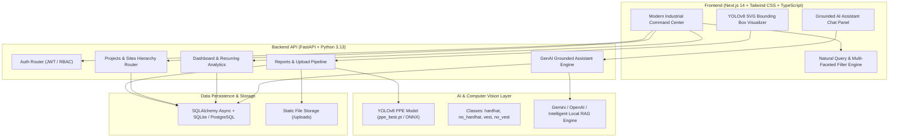

# 🦺 SiteSense — Construction Site Intelligence Platform

> **Full-Stack Autonomous Construction Intelligence & Safety Audit Platform**
> Real-time YOLOv8 Computer Vision PPE Inspection, Grounded GenAI RAG Assistant, and Operations Command Center.

---

## 🌟 Overview & System Capabilities

SiteSense helps Construction Project Managers, Site Supervisors, Safety Officers, and Trade Contractors answer:
- **What is happening at the site?** Real-time daily progress logs, inspection records, and contractor field observations across hierarchical project zones.
- **What issues have occurred, and where?** Automated YOLOv8 object detection on site photographs detecting Hardhats, Safety Vests, and flagging violations with exact bounding boxes.
- **Which problems are recurring?** Automated temporal clustering identifying repeated infractions by site area and violation class.
- **What areas need attention?** Visual command center dashboard, multi-faceted natural query discovery, and a grounded GenAI Copilot.

---

## 🏗️ System Architecture



---

## 🚀 Quick Start Guide

### Prerequisites
- Python 3.11+ (Python 3.13 supported)
- Node.js 18+ (Node v24 supported)
- npm 9+

### ⚡ 1-Click Launch (Windows)
Double-click [`start.bat`](file:///e:/buildathon/start.bat) in the project root to automatically start both the FastAPI backend and Next.js frontend in separate terminal windows.

---

### Manual Startup

#### 1. Backend Setup & Startup

```bash
# Navigate to backend directory
cd backend

# Install dependencies
pip install -r requirements.txt
pip install ultralytics torchvision opencv-python pydantic-settings email-validator

# Populate realistic demo database with YOLO detections
python seed.py

# Start FastAPI backend server (port 8000)
uvicorn app.main:app --host 127.0.0.1 --port 8000 --reload
```

Swagger API Documentation is live at: [http://127.0.0.1:8000/docs](http://127.0.0.1:8000/docs)

---

### 2. Frontend Setup & Startup

```bash
# Navigate to frontend directory
cd frontend

# Install npm dependencies
npm install

# Start Next.js development server (port 3000)
npm run dev -- -p 3000
```

Open the web platform in your browser at: [http://localhost:3000](http://localhost:3000)

---

## 🔑 Demo Role Credentials

| Role | Email | Password | Description |
|---|---|---|---|
| **Project Director (Admin)** | `admin@example.com` | `password` | Full project & zone management, executive analytics |
| **Site Supervisor** | `supervisor@example.com` | `password` | Daily work logs, progress reporting, area supervision |
| **Safety Officer** | `safety@example.com` | `password` | Safety audits, PPE inspections, hazard logging |
| **General Contractor** | `contractor@example.com` | `password` | Trade crew reporting, site observations |

*(One-click demo sign in buttons are available on `/login`)*

---

## 🤖 AI & GenAI Components

### 1. YOLOv8 PPE Computer Vision Model
- **Model Checkpoint**: Fine-tuned YOLOv8n (`ai model/ai/models/ppe_best.pt`, 6.25MB)
- **Target Vocabulary**: `hardhat`, `no_hardhat`, `vest`, `no_vest`
- **Inference Speed**: ~20-30ms CPU inference per image
- **Integration**: Invoked synchronously on every photo upload in `POST /sites/{site_id}/reports` and `POST /detect`. Detections stored with bounding box coordinates `[bbox_x, bbox_y, bbox_w, bbox_h]` and compliance status.

### 2. Grounded GenAI Site Assistant
- **Endpoint**: `POST /assistant/query`
- **Context Engine**: Extracts date range, site scope, report classifications, and recurring issues from user queries, retrieving real project records.
- **Grounding Guarantee**: Enforces report citation badges `[Report #id]`. If `GEMINI_API_KEY` or `OPENAI_API_KEY` is provided, queries the LLM; otherwise uses the built-in intelligent contextual synthesis engine.

---

## 🧪 Testing

```bash
# Run backend test suite
cd backend
pytest tests/
```
All unit tests verify Auth, Projects, Sites, YOLOv8 detections, Dashboard aggregates, Recurring issues, and Assistant citations.
